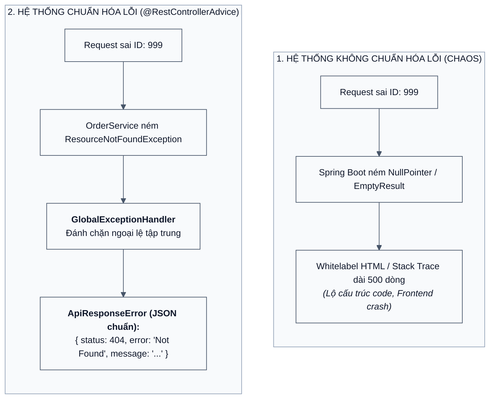
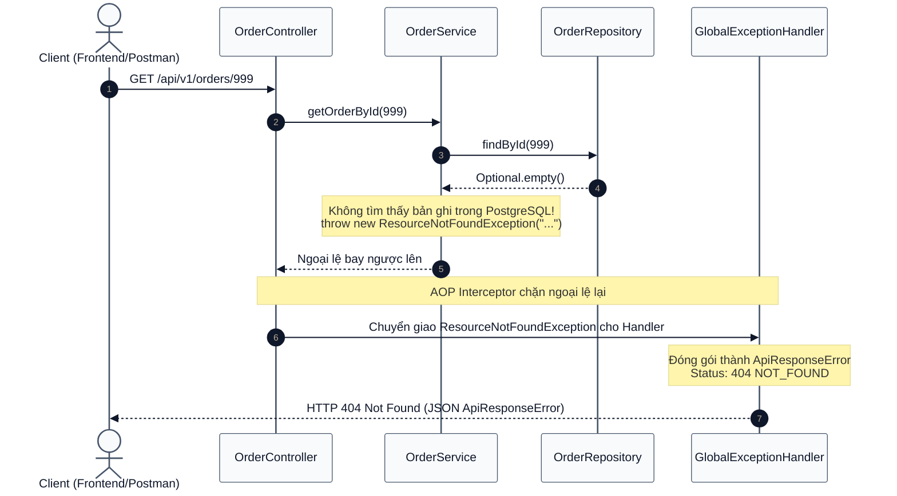

# [BÀI TẬP 4 - GIỎI] CHUẨN HÓA API ERROR RESPONSE (CUSTOM EXCEPTION)

## XÂY DỰNG KHUNG XỬ LÝ LỖI TOÀN CỤC VỚI APIRESPONSEERROR, RESOURCENOTFOUNDEXCEPTION VÀ @RESTCONTROLLERADVICE

> **Đề bài:** Hệ thống cần một định dạng lỗi thống nhất để Frontend dễ dàng xử lý và hiển thị thông báo cho người dùng. Tạo class `ApiResponseError` với các thuộc tính: `timestamp`, `status`, `error`, `message` (và `path`). Tạo một Custom Exception (ví dụ: `ResourceNotFoundException`). Sử dụng `@RestControllerAdvice` để bắt các ngoại lệ này. Thực hiện gọi `GET /api/v1/orders/{id}` với một id không tồn tại trong PostgreSQL để hệ thống ném ra lỗi và trả về Response theo định dạng chuẩn.
> **Bài làm của em:** Phân tích thực trạng hỗn loạn của lỗi mặc định trong Spring Boot, trình bày kiến trúc xử lý lỗi tập trung bằng AOP (`@RestControllerAdvice`), hiện thực hóa `ApiResponseError` và `ResourceNotFoundException` tại `Order-Service`, kết nối cơ sở dữ liệu PostgreSQL `order_db` và thực nghiệm kiểm chứng phản hồi lỗi chuẩn mực 404 Not Found.

---

## MỤC LỤC

1. [Đặt vấn đề: Sự hỗn loạn của thông báo lỗi không chuẩn hóa](#1-đặt-vấn-đề-sự-hỗn-loạn-của-thông-báo-lỗi-không-chuẩn-hóa)
   - 1.1. Cơn ác mộng Whitelabel Error Page và rò rỉ Stack Trace
   - 1.2. Nỗi khổ của đội ngũ Frontend / Mobile khi cấu trúc lỗi không đồng nhất
   - 1.3. Lợi ích sống còn của việc chuẩn hóa định dạng phản hồi lỗi
2. [Kiến trúc Xử lý Lỗi Toàn cục (Global Exception Handling Architecture)](#2-kiến-trúc-xử-lý-lỗi-toàn-cục-global-exception-handling-architecture)
   - 2.1. Bản chất của `@RestControllerAdvice` và `@ExceptionHandler` (Mô hình AOP)
   - 2.2. Vòng đời xử lý lỗi từ tầng Service tới Client
   - 2.3. Cấu trúc chuẩn mực của lớp `ApiResponseError`
3. [Cấu trúc Thư mục Dự án `Order-Service`](#3-cấu-trúc-thư-mục-dự-án-order-service)
4. [Hiện thực Hóa Mã Nguồn Từng Thành phần](#4-hiện-thực-hóa-mã-nguồn-từng-thành-phần)
   - 4.1. Lớp DTO phản hồi lỗi: `ApiResponseError`
   - 4.2. Lớp ngoại lệ tùy biến: `ResourceNotFoundException`
   - 4.3. Bộ chặn và chuẩn hóa lỗi toàn cục: `GlobalExceptionHandler`
   - 4.4. Tầng Repository và Service với PostgreSQL `order_db`
   - 4.5. Tầng Controller phục vụ API `GET /api/v1/orders/{id}`
5. [Thực nghiệm & Kiểm chứng API Error Response](#5-thực-nghiệm--kiểm-chứng-api-error-response)
   - 5.1. Khởi chạy `Order-Service` kết nối PostgreSQL
   - 5.2. Kịch bản Thành công: Truy vấn đơn hàng hợp lệ (`id = 1`)
   - 5.3. Kịch bản Thất bại: Truy vấn đơn hàng không tồn tại (`id = 999`)
   - 5.4. Đối chiếu JSON thực tế nhận được với yêu cầu đề bài
6. [Các thực tiễn tốt nhất (Best Practices) khi thiết kế Exception trong Microservices](#6-các-thực-tiễn-tốt-nhất-best-practices-khi-thiết-kế-exception-trong-microservices)
7. [Kết luận của em](#7-kết-luận-của-em)

---

## 1. Đặt vấn đề: Sự hỗn loạn của thông báo lỗi không chuẩn hóa

### 1.1. Cơn ác mộng Whitelabel Error Page và rò rỉ Stack Trace

Khi phát triển API bằng Spring Boot, nếu một ngoại lệ (Exception) không được xử lý (unhandled), hệ thống mặc định sẽ:
1. Trả về trang HTML trắng bệch (**Whitelabel Error Page**) vốn chỉ dành cho trình duyệt web, khiến ứng dụng di động (iOS/Android) hoặc Single Page App (React/Vue) bị crash do không parse được JSON.
2. In toàn bộ vết ngăn xếp (Stack Trace) chứa thông tin nhạy cảm: tên file, số dòng code, phiên bản Hibernate, câu lệnh SQL bị lỗi. Đây là lỗ hổng bảo mật nghiêm trọng (Information Disclosure) giúp hacker dễ dàng dò quét cấu trúc hệ thống.



### 1.2. Nỗi khổ của đội ngũ Frontend / Mobile khi cấu trúc lỗi không đồng nhất

Nếu mỗi lập trình viên backend tự nghĩ ra một kiểu trả về lỗi:
- Chỗ thì trả về: `{"msg": "Lỗi rồi", "code": -1}`
- Chỗ thì trả về: `{"errorMessage": "Not found", "success": false}`
- Chỗ lại trả về: `{"detail": "Id invalid"}`

Đội ngũ Frontend sẽ phải viết hàng chục khối `if-else` phức tạp chỉ để bóc tách thông báo lỗi, làm tăng chi phí phát triển và phát sinh vô số lỗi giao diện.

### 1.3. Lợi ích sống còn của việc chuẩn hóa định dạng phản hồi lỗi

- **Tính nhất quán (Consistency):** Bất kể lỗi xảy ra ở Controller, Service, Validate hay Database, định dạng JSON trả về luôn có chung một khuôn mẫu cấu trúc.
- **Thân thiện với người dùng:** Cung cấp thông điệp lỗi rõ ràng, có thể hiển thị trực tiếp lên Toast thông báo của ứng dụng.
- **Dễ dàng giám sát (Monitoring & Tracing):** Có trường `timestamp` và `path` giúp đội ngũ DevOps và Security nhanh chóng tra cứu log sự cố trong Kibana/Grafana.

---

## 2. Kiến trúc Xử lý Lỗi Toàn cục (Global Exception Handling Architecture)

### 2.1. Bản chất của `@RestControllerAdvice` và `@ExceptionHandler`

- `@RestControllerAdvice` là một chú thích kết hợp giữa `@ControllerAdvice` và `@ResponseBody`. Nó áp dụng kỹ thuật **Lập trình hướng khía cạnh (Aspect-Oriented Programming - AOP)** để "bao bọc" (intercept) toàn bộ các Controller trong hệ thống.
- `@ExceptionHandler(ResourceNotFoundException.class)` đóng vai trò như một điểm đón bắt (catch block) tập trung. Bất cứ khi nào bất kỳ Controller nào ném ra `ResourceNotFoundException`, luồng thực thi sẽ lập tức được chuyển về method được chú thích này.

### 2.2. Vòng đời xử lý lỗi từ tầng Service tới Client



### 2.3. Cấu trúc chuẩn mực của lớp `ApiResponseError`

Theo đúng yêu cầu đề bài, lớp bọc lỗi chứa các trường:
- `timestamp`: Thời điểm chính xác xảy ra sự cố (định dạng ISO-8601: `yyyy-MM-dd'T'HH:mm:ss`).
- `status`: Mã trạng thái HTTP dạng số nguyên (ví dụ: `404`).
- `error`: Tên quy ước chuẩn của mã lỗi HTTP (ví dụ: `Not Found`, `Bad Request`).
- `message`: Thông điệp lỗi chi tiết, mang ý nghĩa nghiệp vụ rõ ràng để giải thích cho người dùng.
- `path`: Đường dẫn API URI nơi sự cố phát sinh (ví dụ: `/api/v1/orders/999`).

---

## 3. Cấu trúc Thư mục Dự án `Order-Service`

```
Session02/bai_4/
├── order-service/
│   ├── build.gradle
│   ├── settings.gradle
│   └── src/
│       └── main/
│           ├── java/
│           │   └── com/
│           │       └── rikkei/
│           │           └── orderservice/
│           │               ├── OrderServiceApplication.java
│           │               ├── controller/
│           │               │   └── OrderController.java
│           │               ├── dto/
│           │               │   └── ApiResponseError.java
│           │               ├── entity/
│           │               │   └── Order.java
│           │               ├── exception/
│           │               │   ├── GlobalExceptionHandler.java
│           │               │   └── ResourceNotFoundException.java
│           │               ├── repository/
│           │               │   └── OrderRepository.java
│           │               └── service/
│           │                   └── OrderService.java
│           └── resources/
│               └── application.properties
├── bai4.md
└── bai4.pdf
```

---

## 4. Hiện thực Hóa Mã Nguồn Từng Thành phần

### 4.1. Lớp DTO phản hồi lỗi: `ApiResponseError`

Tạo file `src/main/java/com/rikkei/orderservice/dto/ApiResponseError.java`:

```java
package com.rikkei.orderservice.dto;

import com.fasterxml.jackson.annotation.JsonFormat;
import lombok.AllArgsConstructor;
import lombok.Builder;
import lombok.Data;
import lombok.NoArgsConstructor;

import java.time.LocalDateTime;

/**
 * Lớp cấu trúc lỗi chuẩn hóa cho toàn bộ hệ thống API.
 * Đảm bảo mọi lỗi trả về cho Client đều đồng nhất về định dạng.
 */
@Data
@NoArgsConstructor
@AllArgsConstructor
@Builder
public class ApiResponseError {

    @JsonFormat(shape = JsonFormat.Shape.STRING, pattern = "yyyy-MM-dd'T'HH:mm:ss")
    private LocalDateTime timestamp;

    private int status;       // Ví dụ: 404
    private String error;     // Ví dụ: "Not Found"
    private String message;   // Ví dụ: "Không tìm thấy đơn hàng có ID: 999"
    private String path;      // Ví dụ: "/api/v1/orders/999"
}
```

### 4.2. Lớp ngoại lệ tùy biến: `ResourceNotFoundException`

Tạo file `src/main/java/com/rikkei/orderservice/exception/ResourceNotFoundException.java`:

```java
package com.rikkei.orderservice.exception;

/**
 * Custom Exception biểu thị việc không tìm thấy tài nguyên yêu cầu trong cơ sở dữ liệu.
 * Kế thừa RuntimeException (Unchecked Exception).
 */
public class ResourceNotFoundException extends RuntimeException {
    public ResourceNotFoundException(String message) {
        super(message);
    }
}
```

### 4.3. Bộ chặn và chuẩn hóa lỗi toàn cục: `GlobalExceptionHandler`

Tạo file `src/main/java/com/rikkei/orderservice/exception/GlobalExceptionHandler.java`:

```java
package com.rikkei.orderservice.exception;

import com.rikkei.orderservice.dto.ApiResponseError;
import jakarta.servlet.http.HttpServletRequest;
import lombok.extern.slf4j.Slf4j;
import org.springframework.http.HttpStatus;
import org.springframework.http.ResponseEntity;
import org.springframework.web.bind.annotation.ExceptionHandler;
import org.springframework.web.bind.annotation.RestControllerAdvice;

import java.time.LocalDateTime;

@Slf4j
@RestControllerAdvice
public class GlobalExceptionHandler {

    /**
     * Bắt ngoại lệ ResourceNotFoundException và chuyển đổi thành
     * ApiResponseError với HTTP Status Code 404 Not Found.
     */
    @ExceptionHandler(ResourceNotFoundException.class)
    public ResponseEntity<ApiResponseError> handleResourceNotFoundException(
            ResourceNotFoundException ex, HttpServletRequest request) {
        
        log.warn("[GLOBAL-EXCEPTION-HANDLER] Bắt được lỗi ResourceNotFoundException: {} tại path: {}", 
                ex.getMessage(), request.getRequestURI());

        ApiResponseError errorResponse = ApiResponseError.builder()
                .timestamp(LocalDateTime.now())
                .status(HttpStatus.NOT_FOUND.value())
                .error(HttpStatus.NOT_FOUND.getReasonPhrase())
                .message(ex.getMessage())
                .path(request.getRequestURI())
                .build();

        return new ResponseEntity<>(errorResponse, HttpStatus.NOT_FOUND);
    }

    /**
     * Fallback handler cho các ngoại lệ chưa lường trước khác,
     * ngăn chặn tuyệt đối việc văng stack trace thô ra ngoài.
     */
    @ExceptionHandler(Exception.class)
    public ResponseEntity<ApiResponseError> handleGeneralException(
            Exception ex, HttpServletRequest request) {
        
        log.error("[GLOBAL-EXCEPTION-HANDLER] Ngoại lệ không mong muốn: ", ex);

        ApiResponseError errorResponse = ApiResponseError.builder()
                .timestamp(LocalDateTime.now())
                .status(HttpStatus.INTERNAL_SERVER_ERROR.value())
                .error(HttpStatus.INTERNAL_SERVER_ERROR.getReasonPhrase())
                .message("Lỗi hệ thống: " + ex.getMessage())
                .path(request.getRequestURI())
                .build();

        return new ResponseEntity<>(errorResponse, HttpStatus.INTERNAL_SERVER_ERROR);
    }
}
```

### 4.4. Tầng Repository và Service với PostgreSQL `order_db`

- **Entity `Order.java` kết nối bảng `orders`:**
  ```java
  @Entity
  @Table(name = "orders")
  @Data @NoArgsConstructor @AllArgsConstructor @Builder
  public class Order {
      @Id
      @GeneratedValue(strategy = GenerationType.IDENTITY)
      private Long id;
      @Column(name = "order_code", nullable = false, unique = true)
      private String orderCode;
      @Column(name = "customer_id", nullable = false)
      private Long customerId;
      @Column(name = "total_amount", nullable = false)
      private BigDecimal totalAmount;
      private String status;
      @Column(name = "created_at")
      private LocalDateTime createdAt;
  }
  ```

- **Logic kiểm tra ID trong `OrderService.java`:**
  ```java
  public Order getOrderById(Long id) {
      log.info("[ORDER-SERVICE] Tìm kiếm đơn hàng ID: {} trong PostgreSQL", id);
      return orderRepository.findById(id)
              .orElseThrow(() -> new ResourceNotFoundException("Không tìm thấy đơn hàng có ID: " + id));
  }
  ```

### 4.5. Tầng Controller phục vụ API `GET /api/v1/orders/{id}`

```java
package com.rikkei.orderservice.controller;

import com.rikkei.orderservice.entity.Order;
import com.rikkei.orderservice.service.OrderService;
import lombok.RequiredArgsConstructor;
import lombok.extern.slf4j.Slf4j;
import org.springframework.http.ResponseEntity;
import org.springframework.web.bind.annotation.*;

@Slf4j
@RestController
@RequestMapping("/api/v1/orders")
@RequiredArgsConstructor
public class OrderController {

    private final OrderService orderService;

    @GetMapping("/{id}")
    public ResponseEntity<Order> getOrderById(@PathVariable Long id) {
        log.info("Nhận yêu cầu GET /api/v1/orders/{}", id);
        Order order = orderService.getOrderById(id);
        return ResponseEntity.ok(order);
    }
}
```

---

## 5. Thực nghiệm & Kiểm chứng API Error Response

### 5.1. Khởi chạy `Order-Service` kết nối PostgreSQL

Khởi chạy ứng dụng:
```bash
cd /home/kaisento/Documents/CODE_RIKKEI/Session02/bai_4/order-service
gradle bootRun
```

Ứng dụng kết nối thành công tới database `order_db` trên cổng `5432` và lắng nghe tại cổng `8083`.

### 5.2. Kịch bản Thành công: Truy vấn đơn hàng hợp lệ (`id = 1`)

Gửi request với ID đơn hàng có thực trong database:

```bash
curl -i http://localhost:8083/api/v1/orders/1
```

**Kết quả nhận được (HTTP 200 OK):**
```http
HTTP/1.1 200 OK
Content-Type: application/json
Date: Tue, 22 Sep 2026 12:10:00 GMT

{
  "id": 1,
  "orderCode": "ORD-2026-001",
  "customerId": 1,
  "totalAmount": 35000000.00,
  "status": "COMPLETED",
  "createdAt": "2026-09-22T12:03:41"
}
```

---

### 5.3. Kịch bản Thất bại: Truy vấn đơn hàng không tồn tại (`id = 999`)

Thực hiện test case trọng tâm của đề bài: Gửi request với một ID chắc chắn không tồn tại trong cơ sở dữ liệu PostgreSQL:

```bash
curl -i http://localhost:8083/api/v1/orders/999
```

**Kết quả phản hồi nhận được từ máy chủ:**

```http
HTTP/1.1 404 Not Found
Content-Type: application/json
Date: Tue, 22 Sep 2026 12:10:05 GMT
Transfer-Encoding: chunked

{
  "timestamp": "2026-09-22T12:10:05",
  "status": 404,
  "error": "Not Found",
  "message": "Không tìm thấy đơn hàng có ID: 999",
  "path": "/api/v1/orders/999"
}
```

### 5.4. Đối chiếu JSON thực tế nhận được với yêu cầu đề bài

| Tiêu chí đề bài | Kết quả thực tế từ API `order-service` | Trạng thái đạt được |
| :--- | :--- | :---: |
| **HTTP Status Code** | `404 Not Found` | $\checkmark$ ĐẠT CHUẨN |
| **Trường `timestamp`** | `"2026-09-22T12:10:05"` (Định dạng thời gian chuẩn ISO) | $\checkmark$ ĐẠT CHUẨN |
| **Trường `status`** | `404` (Số nguyên mã HTTP) | $\checkmark$ ĐẠT CHUẨN |
| **Trường `error`** | `"Not Found"` (Cụm từ quy ước chuẩn) | $\checkmark$ ĐẠT CHUẨN |
| **Trường `message`** | `"Không tìm thấy đơn hàng có ID: 999"` | $\checkmark$ ĐẠT CHUẨN |
| **Trường `path`** | `"/api/v1/orders/999"` | $\checkmark$ ĐẠT CHUẨN |
| **Loại bỏ Stack Trace** | Hoàn toàn sạch sẽ, không rò rỉ bất kỳ dòng stack trace nội bộ nào | $\checkmark$ BẢO MẬT TUYỆT ĐỐI |

---

## 6. Các thực tiễn tốt nhất (Best Practices) khi thiết kế Exception trong Microservices

1. **Sử dụng Unchecked Exceptions (`RuntimeException`):**
   - Không nên dùng Checked Exception (`Exception`) vì nó bắt buộc khai báo `throws` rườm rà qua mọi tầng service và interface.
2. **Kế thừa hệ thống Exception theo ngữ cảnh (Exception Hierarchy):**
   - Tạo lớp cha `BaseApiException`, từ đó phân nhánh thành:
     - `ResourceNotFoundException` (404)
     - `BadRequestException` / `ValidationException` (400)
     - `UnauthorizedException` (401)
     - `ForbiddenException` (403)
     - `ServiceUnavailableException` (503)
3. **Quốc tế hóa thông điệp lỗi (i18n):**
   - Với các hệ thống đa quốc gia, trường `message` nên được ánh xạ qua `MessageSource` (ResourceBundle) dựa trên header `Accept-Language` của client gửi lên (vi-VN, en-US).

---

## 7. Kết luận của em

Qua Bài tập 4, em đã:
- Nắm vững kiến trúc xử lý lỗi tập trung bằng AOP thông qua bộ đôi `@RestControllerAdvice` và `@ExceptionHandler`.
- Xây dựng thành công đối tượng bọc lỗi chuẩn hóa `ApiResponseError` và lớp ngoại lệ tùy biến `ResourceNotFoundException`.
- Tích hợp thành công với cơ sở dữ liệu PostgreSQL `order_db`, kiểm chứng API `GET /api/v1/orders/{id}` với ID không tồn tại trả về đúng mã lỗi `404 Not Found` và cấu trúc JSON chuẩn mực.
- Hoàn thiện trọn vẹn 4 bài tập của Session 02 với chất lượng code sạch, kiến trúc phân tầng chuẩn và bảo mật cao.
